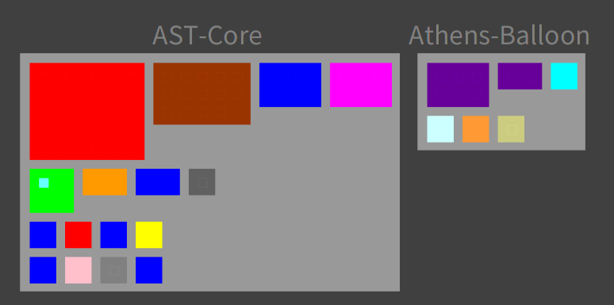
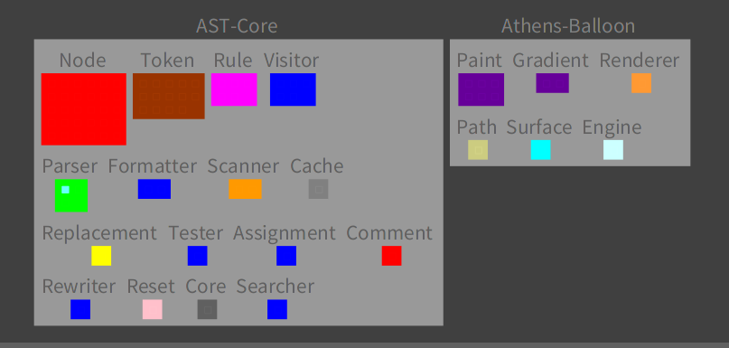

# ClassNameAnalyser

[](https://travis-ci.org/NourDjihan/ClassNameAnalyser)
[](https://ci.appveyor.com/project/NourDjihan/classnameanalyser)
[](https://coveralls.io/github/NourDjihan/ClassNameAnalyser?branch=master)
[](https://raw.githubusercontent.com/NourDjihan/ClassNameAnalyser/master/LICENSE)

## Installation

In order to install this project, execute (Do-it, Ctrl+D) the following script in the Playground of your Pharo image:

```Smalltalk
Metacello new
  baseline: 'ClassNameAnalyser';
  repository: 'github://NourDjihan/ClassNameAnalyser/src';
  load.
```
## How to use the ClassNameAnalyser

In this section i show how to use the code of the ClassNameAnalyser.
First, we define our features by creating a feature selector:

```Smalltalk
featureSelector := DMFeatureSelector new.
featureSelector 
  stemming: true;
  filterAllDigits: true; 
  filterSpecialChars: true;
  selectLastSymbol: true.
  ```  
By default everything is false.
Second, we create a conceptual model from package names by applying the features already defined:
```Smalltalk
conceptualModel := featureSelector applyFeaturesOn: aCollectionOfPackageNames
  ``` 
  Thrid, we build the view model which contains all the informations concerning the visualisation:
  ```Smalltalk
  builder := DMClassNameBlueprintBuilder new.
  builder orderAttributor 
    orderFromBiggest: true.
 viewModel := builder buildModelFrom: conceptualModel.
   ``` 
   Finally, in order to visualize our view model we use:
   ```Smalltalk
   roassalView := DMRoassalClassNameBlueprint new.
   roassalView visualize: viewModel
   ``` 
   ## Visualization Example:

  
   
   
   
