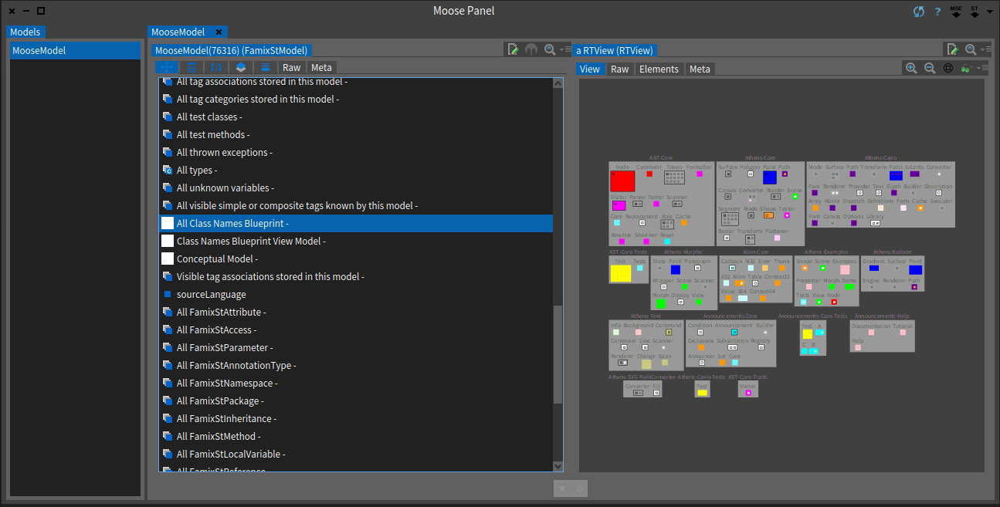
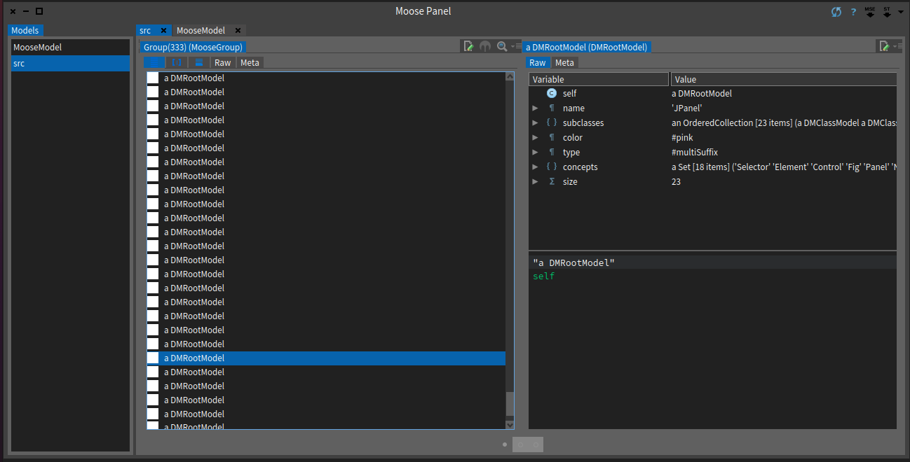

# ClassNameAnalyser
 
[](https://coveralls.io/github/NourDjihan/ClassNameAnalyser?branch=master)
[](https://raw.githubusercontent.com/NourDjihan/ClassNameAnalyser/master/LICENSE)

## Installation

In order to install this project, execute (Do-it, Ctrl+D) the following script in the Playground of your Moose 9 Image

```Smalltalk
Metacello new
  baseline: 'ClassNameAnalyser';
  repository: 'github://NourDjihan/ClassNameAnalyser/src';
  load.
```
## ClassNameAnalyser Description:
The **ClassNameAnalyser** is a visualisation of the distribution of concepts in both **Java** and **Pharo** projects using the *ClassNames Blueprint*. The distribution of concepts in projects starts from the simple hypothesis: most programmers use english when writing code hence, when naming their classes, the standard format of the class name usually has the concept written at the end of the word (as a suffix). For instance, when you read this project's name which is `ClassNameAnalyser`, you instinctly undertsood its functionality which is analysing. An example of a class name written in english could be: `ConceptualModel`, could you guess what the class might represent? Indeed! it is a model (it's okey if you didn't guess it, you might have been programming in an other language other than english, or more often than not .. not at all). However, analysing class naming conventions is the main goal of this project, in fact the *ClassNames Blueprint* proved to be helpful in detecting inconsistencies in different projects naming conventions. Furthermore, it displays the project's main concepts and, their locations.

## How to use the ClassNameAnalyser With Moose
After loading the *ClassNameAnalyser*, load your project/packages into the Moose Panel, you'll see all the **root models** (all the hierarchies) of your packages/project ,scroll to see the **ClassNames Blueprint** visualisation, the **conceptual model** and the **view model**. Luckily, the Moose Panel has the option of loading Java projects, but first one must create the .mse file of the java project so it can be loaded and analysed.

In case you are not familiar with Moose, or do not know how to create the .mse file of your java project, I suggest you have a look at the [Moose Book](http://www.themoosebook.org/book/).

## Understanding your Visualisation:
The visualisation uses boxes to wrap up packages, which contain concept boxes that wrap up class boxes belonging to the package and having the concept's box name as a suffix of the class name. Basically, the *ClassNameAnalyser* is a representation of the *ClassNames Blueprint* which is based on these simple conventions shown in the table below:

Class Type | Description | Color
--- | --- | --- |
**Mono Class** | a class which belongs to no hierarchy | white
**Trait Class** | a class containing a set of methods that can be used to extend the functionality of a class | white
**Mono Suffix Hierarchy** | Hierarchies which use the same naming convention (all classes of a tree hierarchy have the same suffix) | Gray
**Multi Suffix Hierarchy** | Hierarchies that do not use the same naming convention | a color is selected from the predefined color palette (24 main colors taken by the first biggest 24 hierarchies in descending order)
**Other hierarchies** (*ignored*) | starting from the 25th biggest hierarchy in the system | Black

Class boxes are colored as their root classes, while concept boxes are colored the same as the biggest root which uses the concept's name.

## A Visual Example:
The figure below depicts a *ClassNames Blueprint* of some packages selected from the Moose Image by clicking on the 'st' option as shown in the above-right of the Moose Panel:




The visualisation below shows a *ClassNames Blueprint* for a [Java project(ArgoUML)](https://github.com/argouml-tigris-org) imported as an .mse file by clicking on the 'mse' option as shown in the above-right of the Moose Panel:
.png)

Figure below depicts the group of Root Models of the ArgoUML Java project and an example of a root model named 'JPanel' which represents the root of an hierarchy consisting of 23 subclasses that use different suffixes (concepts), which makes this hierarchy a Multi-Suffix hierarchy, and is colored in pink.



